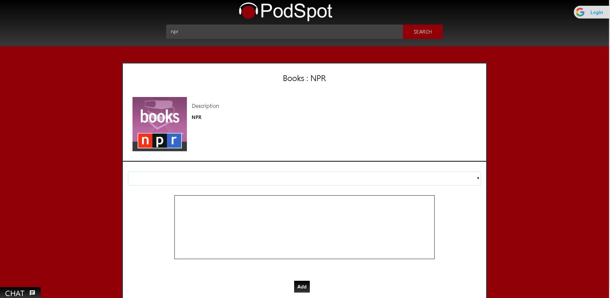

# PodSpot 

### Check out the live version on heroku
**[PodSpot](https://the-podspot.herokuapp.com/)**

## Description 

Do you like __podcast__? Do you want to connect with others? Do you want to know what others think about certain __podcast__?
Well you have come to the right __spot__! This app allows users to search any podcast by name, episode or keywords! Get back a list!
*click* and open up! You will see a *description*, the **title** and a **link** to to episode! If there are reviews already you will see those to!
You can leave your own review to and have it save to your username!

### Future updates
* Fully Functional Chat
* Profile page
* Friends List

***

## Technologies used
- Node.js                       
- Javascript    
- Jquery
- Materialize
- HTML/CSS
- Handlebars.js
- NPM body-parser
- NPM express 
- NPM dotenv
- NPM mysql2
- NPM express-handlebars
- NPM podcast-search
- NPM sequelize
- NPM cookie-parser
- NPM passport
- NPM passport-google-oauth
- NPM socket-io
- NPM morgan
    * Optional use
    - vagrant

    ___ 

## Instructions for local use
**prerequisites**
- Install node.js/npm

    - Git-Clone to repo to a spot on your desktop
    - in your favorite CLI (gitbash/terminal) cd to the folder with .git
    - there will also be a vagrantfile in this folder
        - (if you do not wish to use vagrant skip these next steps)
        - vagrant up to initialize the box
        - vagrant ssh when ready
        - cd /var/www
        - npm install
        - node server.js
        - go to 192.168.15.111:3000 on your browser
        - (make sure you have a mysql database(workbench, pro, heidi, etc.))
    - npm install
    - node server.js
    - localhost:3000 on your browser

# Contributors
- *Joshua LeBoeuf* 
  * [HumanJBooF](https://github.com/HumanJBooF) 
- *Ian Cogswell* 
  * [Aroarian](https://github.com/aroarian)
- *Cody Shaffer*
  * [Eshaffer5612](https://github.com/Eshaffer5612)
- *Peter Grieve*
  * [PeterGrieve](https://github.com/PeterGrieve)
- *Bob Williams*
  * [bob-williams-1](https://github.com/bob-williams-1)

